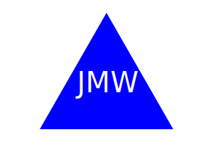

# My-Little-Logo-Maker

## Description
This application generates a simple logo based on user input. After running the application, the user is prompted with four (4) questions in the command line. After all four questions are answered, an .svg file is generated based on the answers.

## Walthrough Video
https://drive.google.com/file/d/1vFx73LiLc5QKiTH8LEjMjTk3GZaB9Q-0/view

## Logo Examples
  

## Technologies Used
NodeJs, Jest, Inquirer, and the File System module
